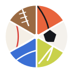
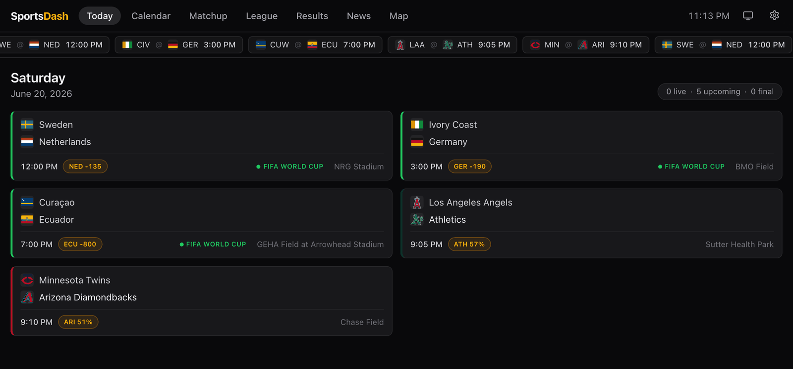
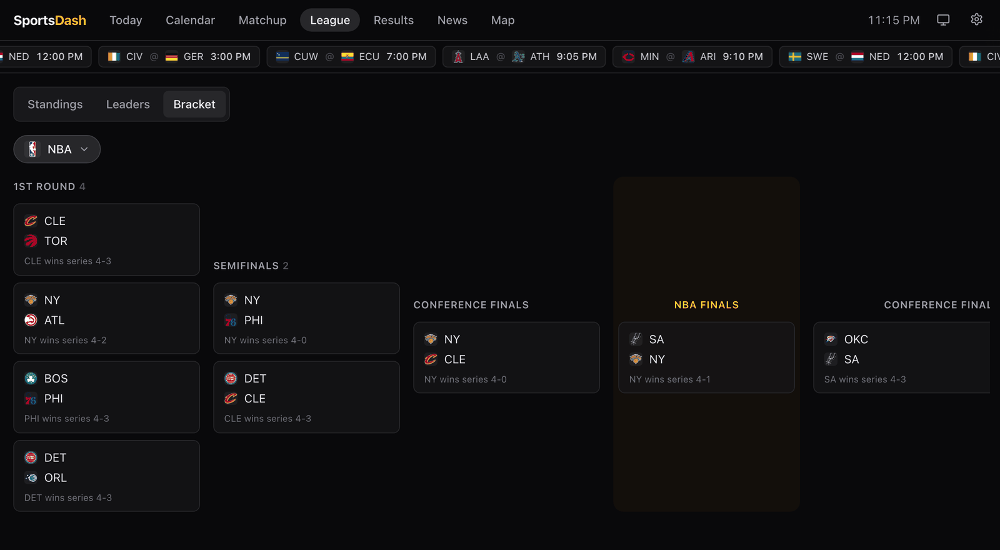
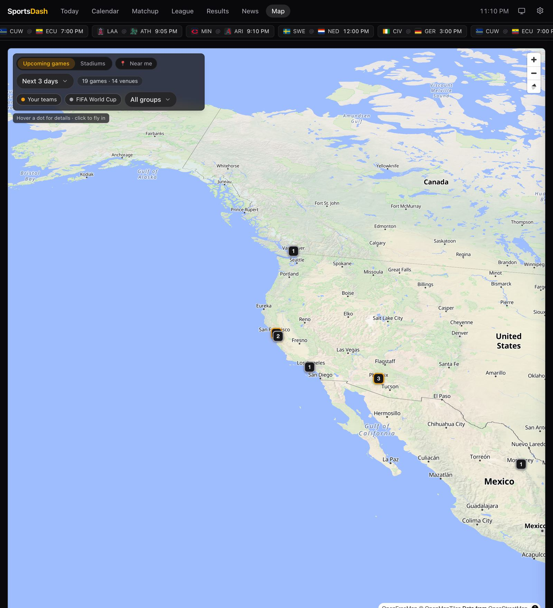
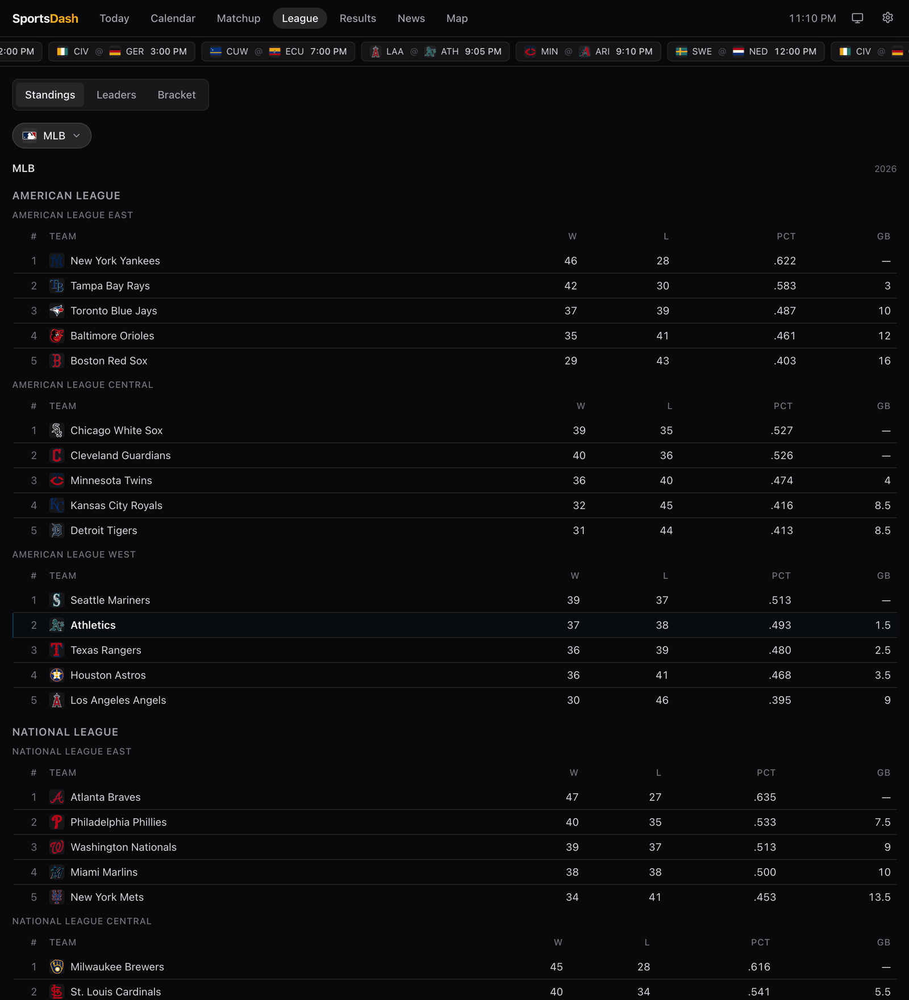
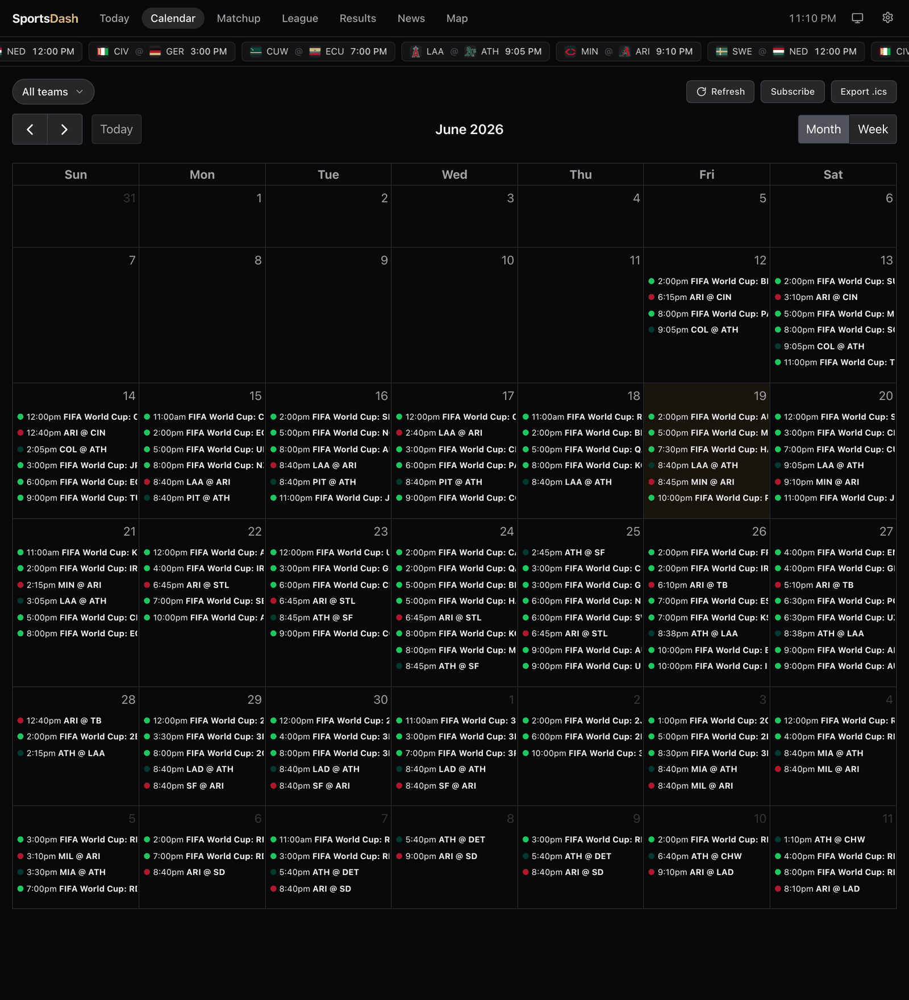
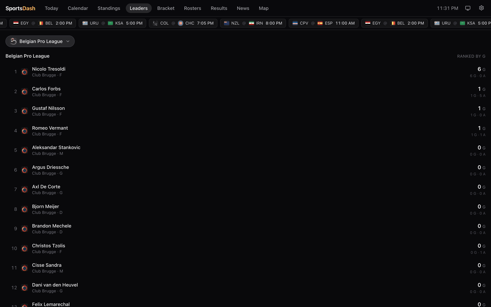
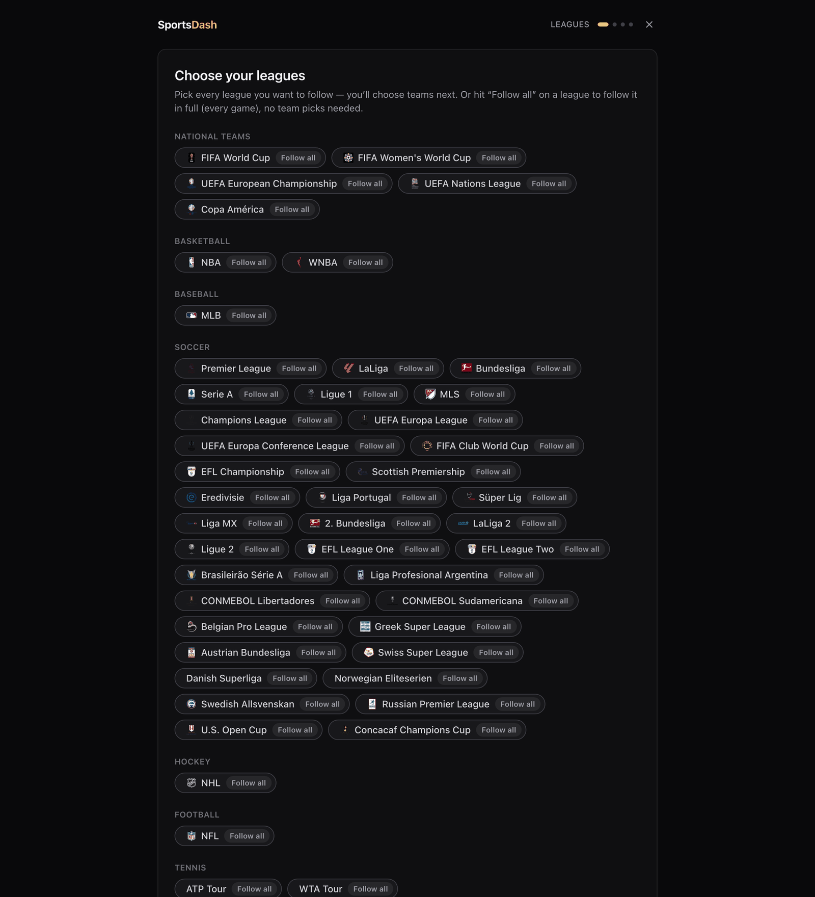
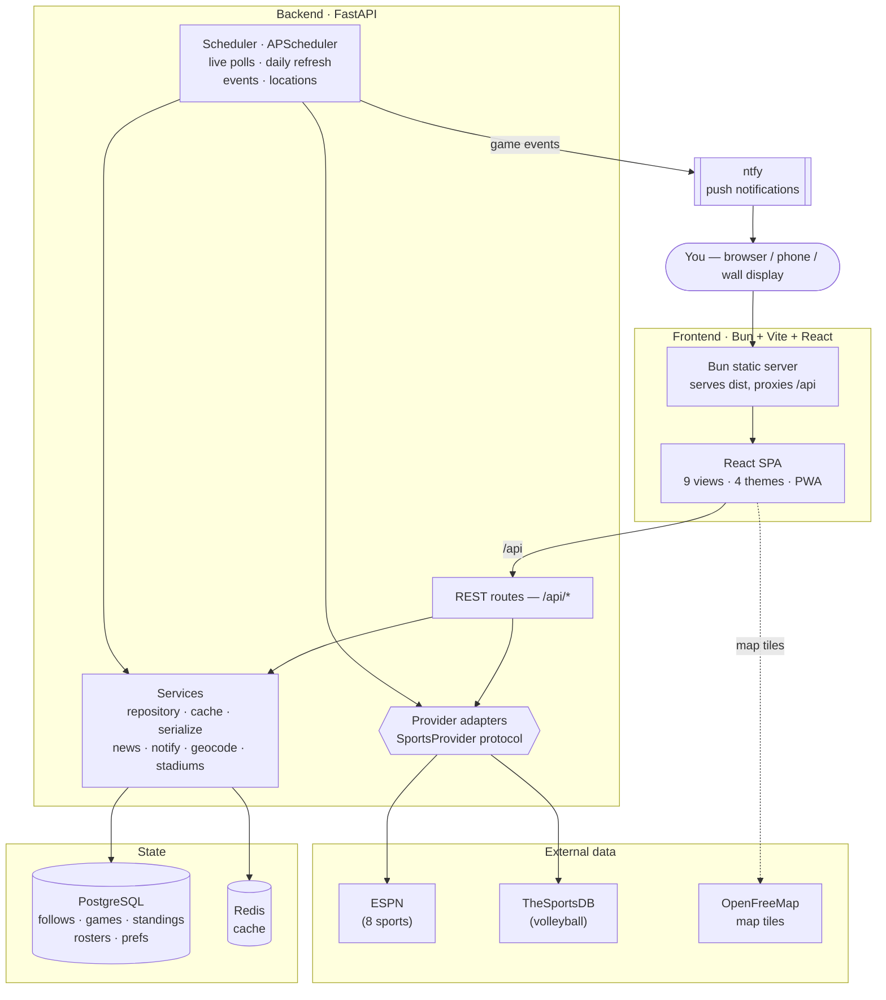
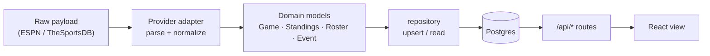

<div align="center">



# SportsDash

**Nine sports · 50+ leagues · one self-hosted screen**

</div>

A single-user, self-hosted **sports dashboard** for a wall display, a
desktop tab, or your phone. Follow teams — or whole leagues — across **nine
sports** and 50+ competitions, and see today's games, live scores, a full
calendar, standings, stat leaders, playoff brackets, rosters, results, news,
and a world map of stadiums, all in one place. Get push notifications when a
game is about to start, a period begins, or a final goes in the books.

Everything runs on your own machine. Run it as a **server** with
`docker compose up` and open it in any browser, or build it as a **native
macOS app** that double-clicks open with the backend bundled inside — see
[Running SportsDash](#running-sportsdash). No accounts, no tracking, one
user: you. Data comes live from ESPN and TheSportsDB — no API keys required.

Sports covered: **basketball, baseball, soccer, hockey, American football,
tennis, MMA, golf, and volleyball.**

## Screenshots



| Playoff bracket | World stadium map |
|---|---|
|  |  |
| **Standings** | **Calendar** |
|  |  |
| **Stat leaders** | **Onboarding — follow a team or a whole league** |
|  |  |

## Features

- **Today** — every game for the teams and leagues you follow, with live
  scores, period/clock, and auto-refresh that polls faster while a game is in
  progress. Click any card for a box score (line scores + top performers).
- **Calendar** — month/week calendar of all games, colored per team, plus an
  `.ics` / `webcal://` feed you can subscribe to from any calendar app.
- **Standings** — per-league tables with sport-appropriate columns and
  conference/division grouping; team crests inline.
- **Leaders** — league-wide stat leaders (points, home runs, goals…), with
  the soccer Golden Boot derived from match scorers. Your players highlighted.
- **Bracket** — soccer cup knockouts (e.g. the World Cup) and the US leagues'
  best-of-N **playoff series** (NBA/NHL/MLB), grouped by round through the
  finals.
- **Rosters** — players, positions, jersey numbers, season stat lines, and
  injury status.
- **Results** — recent finals per team with streak / last-10 chips.
- **News** — aggregated headlines per team (ESPN + Google News + RSS) with an
  in-app reader.
- **Map** — every followed team's (and active competition's) home venue on a
  MapLibre map with 3D buildings; click a pin for stadium facts and fixtures.
- **Team & nation profiles** — click a team anywhere to open a unified page:
  next match, recent form, fixtures, results, roster, news, and stadium.
- **Notifications** — pushed to your own [ntfy](https://ntfy.sh) topic:
  starting soon, game start, period start, intermission, and final.
  Deduplicated, so the same alert never fires twice.
- **Themes & kiosk** — four themes (Light, Dark, Newsprint, Stadium), a
  kiosk auto-rotation mode with an idle clock, and an installable PWA.

## The pages, one by one

The dashboard is a single-page app with seven tabs across the top, plus
slide-over panels you reach by clicking a team or game anywhere in the UI.

| Tab | What you see / do |
|---|---|
| **Today** | The landing page: every game for your follows on the local calendar day, with live score, period, and clock. It auto-refreshes — fast while a game is in progress, slow otherwise. Click a card for a **box score** (line scores + top performers). In-progress golf/tennis leaderboards show up here too. |
| **Calendar** | A month / week grid of all your fixtures, color-coded per team. **Subscribe** hands you ready-made `webcal://` feeds (all games, or one per team) and a one-off `.ics` export. |
| **Matchup** | A pre-game **preview browser**: upcoming games with head-to-head context — recent form, last meetings, and where each side sits — so you can scan what's coming before it starts. |
| **League** | Pick one of your leagues and drill in through three sub-tabs: **Standings** (sport-appropriate columns, conference/division grouping), **Leaders** (stat leaders, or the soccer Golden Boot), and **Bracket** (cup knockouts and best-of-N playoff series, grouped by round). |
| **Results** | Recent **finals** per followed team, newest first, with streak and last-10 chips. |
| **News** | Aggregated headlines per team (ESPN + Google News + RSS) with an in-app reader. |
| **Map** | Every followed team's — and every active competition's — home venue on a MapLibre world map with 3D buildings. Click a pin for stadium facts, current weather, and upcoming fixtures there. |

**Slide-over panels (click to open):**

- **Team / nation profile** — click any crest to open a unified page: next
  match, recent form, fixtures, results, roster, news, and home stadium (with
  a jump-to-Map button).
- **Setup wizard** — *Manage teams* (and the first-run screen): choose
  leagues and teams, or **Follow all** a whole competition.
- **Settings & notifications** — theme switcher, per-scope notification
  toggles, and kiosk mode.

## Architecture



Two principles shape the codebase:

- **Provider adapters.** Every data source implements the `SportsProvider`
  protocol (`backend/app/providers/base.py`) and normalizes its payloads into
  shared domain models — including sport-specific period semantics (`Q3`,
  `2nd Half`, `Top 5`, `P2`, `Set 3`). Routes, services, and the scheduler
  never see provider- or sport-specific fields, so adding a source or a sport
  rarely touches them. ESPN backs eight sports; TheSportsDB backs volleyball.



- **UTC internally.** Every stored or compared datetime is timezone-aware
  UTC. Your configured timezone (`SPORTSDASH_TIMEZONE`) is applied only at the
  response boundary ("today" computation, the daily refresh hour) and in the
  frontend's display formatting.

**Stack:** React + Vite + Tailwind v4 + TanStack Query (frontend, served by
Bun); FastAPI + SQLAlchemy (async) + APScheduler (backend); PostgreSQL for
storage, Redis for caching, ntfy for push. Tests and local dev run on SQLite
with zero setup.

## Running SportsDash

SportsDash runs **two ways from the same codebase** — pick whichever fits.
Both are single-user and self-hosted, and choosing one takes nothing away
from the other.

### Option A — Docker (browser)

The server deployment: runs anywhere Docker does, reached from any browser on
your network (a laptop, a phone, a wall display).

```sh
cp .env.example .env       # set your timezone and ntfy topic
docker compose up -d --build
```

Then open:

- Dashboard — <http://localhost:3000>
- API docs (Swagger) — <http://localhost:8001/docs> (loopback-only; the
  dashboard proxies `/api` internally, so other devices never need this port)
- ntfy — <http://localhost:8090>

On first load the dashboard opens the **setup wizard**: choose the leagues
and teams you want, and SportsDash pulls their live data from ESPN /
TheSportsDB and starts populating every view.

For game notifications on your phone, install the ntfy mobile app, add your
server (`http://<your-host>:8090`), and subscribe to your topic
(`SPORTSDASH_NTFY_TOPIC`, default `sportsdash`).

### Option B — macOS desktop app

A native `SportsDash.app` you double-click — **no browser, no Docker, and no
Python to install.** The FastAPI backend is frozen into the bundle and starts
automatically when you launch the app. Build it with one command:

```sh
./scripts/build-desktop.sh
```

This produces `SportsDash.app` (and a shareable `.dmg`) under
`frontend/src-tauri/target/release/bundle/`. Drag the app to `/Applications`
and open it — the bundled backend boots, then the same first-run setup wizard
appears. Architecture, prerequisites, where the database lives, and
code-signing notes are documented in **[docs/desktop.md](docs/desktop.md)**.

## Following teams

Your followed set lives in the **database** and is chosen through the in-app
**setup wizard** (Settings → *Manage teams*, or the first-run screen):

1. **Choose leagues** — pick from 50+ leagues and competitions grouped by
   sport. Every league offers a **Follow all** toggle to follow it in full
   (every game, no team picks) — handy for a playoff race or the World Cup.
2. **Pick teams** — for leagues you didn't "Follow all", select the specific
   teams (or players/fighters/golfers) to follow.
3. **Review & confirm** — confirming replaces your previous follows and kicks
   an immediate background sync, so data starts loading right away.

> Advanced: `backend/config/teams.yaml` is an optional bootstrap template,
> read **only** while the teams table is empty (so it never clobbers wizard
> picks). Authoring your follows there marks the app onboarded and skips the
> wizard. The normal path is the wizard.

## Notifications

The scheduler polls live games at a fast cadence only while a followed team
is playing (or about to). Detected transitions are pushed to
`{SPORTSDASH_NTFY_URL}/{SPORTSDASH_NTFY_TOPIC}`:

| Event | When |
|---|---|
| Starting soon | 15 minutes before tip-off (`SPORTSDASH_STARTING_SOON_MINUTES`) |
| Game start | Scheduled → in progress |
| Period start | Each new quarter/half/inning/period after the first |
| Intermission | Halftime / between periods, with the current score |
| Final | Game ends, with the final score |

Each event is recorded after a successful send, so restarts and re-polls never
duplicate an alert. Whole-league follows default to game-start + final only
(a spam guard), and per-scope mute / event toggles live under
`/api/notifications/prefs`. Set `SPORTSDASH_NOTIFICATIONS_ENABLED=false` to
silence everything without touching the rest of the stack.

## Subscribe to your calendar

The schedule is exported as a standard iCalendar feed, so SportsDash games
can live inside Apple Calendar, Google Calendar, or any calendar app that
supports subscriptions.

- **All games:** `http://<your-host>:3000/api/calendar.ics` (covers −30 …
  +60 days). For a *live, auto-updating* subscription use the `webcal://`
  scheme — `webcal://<your-host>:3000/api/calendar.ics`.
- **One team:** append `?team_id=<team-id>`, e.g.
  `webcal://<your-host>:3000/api/calendar.ics?team_id=<team-id>`.

(The feed goes through the frontend on port 3000, which proxies `/api` —
the API itself is bound to loopback and isn't reachable from other
devices.)

In the Calendar tab, **Subscribe** offers ready-made `webcal://` links (all
games plus one per followed team) with copy-to-clipboard, alongside the
one-off **Export .ics** download.

## Kiosk mode

SportsDash is built to live on a wall display. Toggle **kiosk mode** with the
monitor icon next to the gear (remembered in `localStorage`):

- The active tab **auto-advances** through every view (~12s, with a visible
  "next in Ns" countdown). Any interaction pauses rotation, then it resumes.
- After idle, a full-screen **idle clock overlay** appears with the local
  time, date, and a compact "N live / N upcoming today" line. Any interaction
  dismisses it.

The app is also an installable **PWA** — add it to your home screen for a
chrome-less, full-screen kiosk window.

## Backups

A `backup` service in `docker-compose.yml` takes a daily logical dump of the
Postgres database: it runs `pg_dump` on a loop, writes a gzipped dump to the
host-mounted `./backups` directory (`sportsdash-YYYYMMDD-HHMMSS.sql.gz`), and
prunes dumps older than 14 days. It's decoupled from the rest of the stack, so
a backup failure never blocks startup.

Restore a dump into a running `db` service with:

```sh
gunzip -c backups/sportsdash-YYYYMMDD-HHMMSS.sql.gz \
  | docker compose exec -T db psql -U sportsdash sportsdash
```

## Local development

Backend (Python 3.12, SQLite by default — zero setup):

```sh
cd backend
python3.12 -m venv .venv
source .venv/bin/activate
pip install -r requirements.txt -r requirements-dev.txt
uvicorn app.main:app --reload          # http://localhost:8000
pytest                                  # run the test suite
```

Frontend (Bun + Vite; the dev server proxies `/api` to `localhost:8000`):

```sh
cd frontend
bun install
bun run dev                             # http://localhost:5173
bun run typecheck                       # tsc --noEmit
```

## API reference

All routes are served under `/api` (interactive docs at `/docs`). A
representative selection:

| Route | Returns |
|---|---|
| `GET /api/health` | Deep check: `{status, database, providers}` (always 200) |
| `GET /api/meta` | App version, timezone, live polling cadence |
| `GET /api/teams` | All followed leagues and teams |
| `GET /api/today` | Today's games and events (local calendar day) |
| `GET /api/schedule?start=&end=&team_id=` | Games in a local-day range |
| `GET /api/standings/{league_id}` | League standings |
| `GET /api/leaders/{league_id}` | League-wide stat leaders (or Golden Boot) |
| `GET /api/bracket/{league_id}` | Playoff series grouped into rounds |
| `GET /api/roster/{team_id}` | Team roster with player status |
| `GET /api/results/{team_id}?limit=` | Recent finals, newest first |
| `GET /api/news?team_id=&limit=` | Aggregated news items |
| `GET /api/games/{game_id}` | On-demand box score (line scores + performers) |
| `GET /api/map` | Followed/competition team venues for the map |
| `GET /api/calendar.ics?team_id=` | iCalendar feed (−30 … +60 days) |
| `GET /api/setup/leagues`, `GET /api/setup/teams/{id}` | Onboarding catalog |
| `POST /api/setup/follow` | Replace the followed set of leagues and teams |

## Adding a provider

1. Create `backend/app/providers/<yourprovider>.py` with a class implementing
   the `SportsProvider` protocol from `backend/app/providers/base.py`.
   Normalize everything into the dataclasses in
   `backend/app/models/domain.py` — including `period` / `period_label` /
   `is_intermission`, so the sport-agnostic event detector works unchanged.
2. Register an instance in `backend/app/providers/registry.py` via
   `register_provider(...)`.
3. Point a league at it — add it to the catalog
   (`backend/app/providers/espn_catalog.py`) or `backend/config/teams.yaml`
   with `provider: <yourprovider>` and your provider's own `provider_key`
   values.

No other code changes are required — the scheduler, services, and routes
resolve providers by the league's `provider` field at runtime.

## Roadmap

Where SportsDash is headed — recently shipped work, near-term packaging and
distribution, and longer-term product ideas — lives in
**[ROADMAP.md](ROADMAP.md)**.
