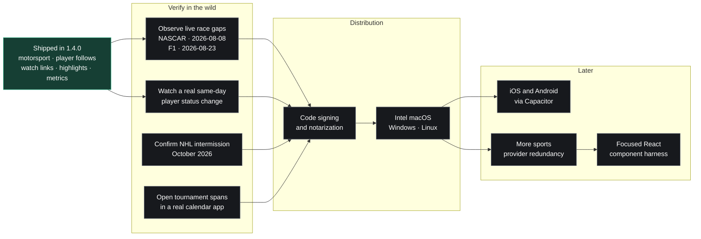

# Roadmap

SportsDash is a single-user, self-hosted personal project. This is a *living
list of intentions*, not a committed schedule — items move, merge, and get
dropped as priorities shift. Grouped by rough horizon.

See the [README](README.md) for what the app already does today.

Every open item below says what it needs **and how you would know it worked**
— the italic *Verify* line. That line is not decoration: four of the things
that shipped on 2026-07-27 were pinned by tests and had still never been
looked at running, and the map bug fixed that day was a confidently wrong
pin that every gate passed happily. A green suite is not a sighting.

## At a glance

The graph is the short version. The dated evidence, decision rules, and
verification criteria remain below so a green test suite is never mistaken
for a live sighting.

## ✅ Recently shipped

- **Setup asks "where?" before "which?"** (2026-08-20) — soccer is 40 of the
  catalog's 55 leagues, and a flat list of all 40 was the worst way to find
  the two you actually watch. ESPN's own league codes carry the country
  (`soccer/eng.1`), so the wizard now opens on a grid of the 21 countries
  that have leagues. Pick England and Spain, and the league step narrows to
  their six; everything belonging to no country (Champions League, World
  Cup, NBA, the tours) is offered either way, and skipping shows everything
  exactly as before. A league already selected survives unpicking its
  country, so going back never silently drops a choice. The step is derived,
  not hardcoded to soccer — a catalog that gains a second country for any
  sport turns it on by itself.
  This shipped as an **OpenStreetMap pin map first, and that was the wrong
  answer**: nine of the twenty-one countries sit within a few degrees of
  each other, so pins overlapped, names had to hide below a zoom threshold,
  and the result was a world map of anonymous dots you had to hover to read
  — worse at the actual question ("which countries can I pick?") than a list
  that answers it at a glance, and it dragged MapLibre (~1.1MB) into the
  onboarding bundle. Replaced same day. The Map view is still where a map
  earns its place: there, position IS the information.

- **The UI has a type scale** (2026-08-19) — the flatness was measurable:
  26 distinct text styles on a page but only **four font sizes**, with 149
  of 150 text elements between 11px and 14px, so page titles, section
  headings, team names and footnotes all sat within 3px of each other.
  Themes remap COLOR only, so no amount of palette work could have fixed
  it. `index.css` now carries a Column layer — a six-step scale, a 940px
  reading measure (1180px where a month grid or a map earns it), two rule
  weights and a listing row — and the seven views compose those classes
  instead of inventing `text-[11px]` locally. Cards and fills give way to
  rules and gutters: Today and Results became listings on a time/date
  gutter, News became a headline listing rather than an image-led grid,
  the Matchup view's empty Upset Radar moved off the top of the screen,
  and Standings lost two of its three stacked league titles (ESPN labels
  an ungrouped table with a restatement of the competition, and ships the
  season as a sentence — both are now suppressed or trimmed). `GameCard`
  is `GameRow`. Applied at the view level: **58 `sd-*` usages in, 58
  ad-hoc pixel sizes still in inner components** (modals, panels, roster,
  bracket) awaiting the same treatment.
- **The separator glyphs were failing WCAG AA in every theme**
  (2026-08-19) — `·`, `@`, `vs` and `Bench:` were painted with
  `text-zinc-600`, a token documented as "muted icon / track", which put
  them at **2.58:1** on the stock dark base. 29 usages across 17 files
  moved to `zinc-500`, the AA-tuned faint-label step; the stock dark
  theme's separators now measure **5.09:1** and every view audited in the
  browser reports zero AA failures.
- **Four themes, one of them yours** (2026-08-19) — the picker is Dark,
  Light, **Custom** and **High contrast**. Custom is the old Stadium
  renamed for what it does: the dark base with the accent driven by a
  followed team's color, lifted toward readability by `accentOnDark` (a
  navy club lands at 9.3:1, not the 1.3:1 its raw hex would give). High
  contrast is an accessibility option rather than a look — true black,
  white headings, every text tone at AAA. Newsprint, Floodlight and Ember
  were retired; `LEGACY_THEME_IDS` maps a stored id from any of them onto
  a survivor in both `lib/theme.ts` and the no-FOUC bootstrap, so a
  returning choice migrates instead of silently resetting.
- **The setup wizard says where you are** (2026-08-19) — the league step
  was a wrapping row of pills that sized themselves by name length, so
  the rows came out ragged and the nested "Follow all" pill read as part
  of the same control. Leagues are now cards in a fixed grid with
  "Follow all" as a separate secondary line, and the header reads
  "Step 1 of 4 · Leagues" instead of one lit dot.

- **Every ESPN call was failing with 403, and nothing said so** (2026-08-19)
  — the outbound `User-Agent` was the bare product token `SportsDash/1.0`,
  and ESPN's edge had begun rejecting it: measured that day, every request
  to `site.api.espn.com` came back `403 Forbidden`, deterministically, 5/5
  by curl from the same address that got `200` seconds later for a
  different string. `sports.core.api.espn.com` never blocked; only the
  `site.api` host did. What passes is a User-Agent naming the project's
  repository — `(self-hosted)` was **not** enough, nor was
  `(+https://example.com)`, so it is the URL specifically and not merely the
  presence of a comment. On a real startup the damage was total and silent:
  standings for all five leagues, every roster, the team catalogs for
  `euros` and `worldcup`, and every schedule fetch failed, each one
  degrading to a logged error while the hermetic suite stayed green. The
  string now lives in one place (`app/useragent.py`), reads from
  `app/version.py`, takes an optional note that rides *inside* the same
  comment as the URL, and is overridable outright with
  `SPORTSDASH_USER_AGENT` — because this is a rule on someone else's edge
  and it can move again. `tests/test_user_agent.py` pins the composition and
  greps `app/` for any module that hardcodes a `User-Agent` of its own,
  which is the test that was missing when the same literal sat in eleven
  files. After the fix the same startup ran 35/35 ESPN calls `200` with zero
  errors.
- **A competition team keeps its stadium too** (2026-08-19) — closing the
  loose end below. `repository.most_common_home_venue_by_name(session,
  league_id, team_name)` tallies a named side's stored home fixtures the way
  `most_common_home_venue` tallies a followed team's, and
  `scheduler/stadium_cache.py` now falls back to it when the provider knows
  no ground. A national side has no `teams` row, so the id-keyed query could
  never see it; it now gets the same fallback everyone else gets. Names
  compare through SQL's own `lower()` on both sides so a match never depends
  on whether the backend's `lower()` is ASCII-only. Four cases pinned: the
  side with no `teams` row, casing drift, a name that only ever played away,
  and a same-named side in another league.
- **"finished 18 (DNF)" is no longer the verb** (2026-08-19) — the
  final-event alert now says a driver *retired* or *was disqualified*, and
  carries the board's position as a classification rather than a finish
  ("Nico Vantage retired (classified 18)"). Keyed on the two `score` tokens
  a racing board actually emits; golf's to-par strings can never match, and
  a test asserts that. Five cases in
  `backend/tests/test_final_event_alert.py`.

- **Race leaderboards carry constructors and race times** (2026-07-29) —
  taking the deferral in the motorsport item below: the per-driver times
  that live on ESPN's core API only are now fetched, so a finished race
  board reads a constructor, car number and grid slot next to a race time,
  a gap ("+15.080", "+1 lap"), laps completed, DNF, or DSQ. Two tiers — one
  core call per active race every poll, and a bounded, memoized per-car
  fan-out once at FINAL, so re-polling a finished race costs nothing. No
  schema change: it rides the leaderboard row's existing display strings.
  Every core fetch degrades to the plain board on any failure. A second pass
  the same day added two things at **zero** extra calls. **A live board now
  renders a running gap** ("+2.418", "+1 lap") when ESPN's scoreboard payload
  — the one the board is already parsed from — carries one for that car;
  that slot exists on every racing competitor but has only ever been observed
  **empty**, so the column may simply stay empty, and the parse is fail-safe
  so a wrong guess about the populated shape costs that one column and
  nothing else (see *Loose ends*). And **a real bug is fixed**: the
  retirement check was a substring test, so a disqualification rendered as a
  finish — six observed cars, three carrying the full race distance and one a
  53-second finishing gap for a car that completed zero laps. The three
  status types (a third one, DSQ, does exist) are now mapped exactly, DSQ
  renders "DSQ · Disqualified", and a car whose status call fails is either
  inferred DNF from measured F1-only thresholds (zero false positives over
  529 classified cars) or labelled "Status unknown" — never implied to have
  finished, and never inferred outside F1, where a car 8 laps down at a short
  track is still circulating. The payload shapes come from a live probe of
  ESPN's core API, but the enriched board has not been looked at in a running
  browser yet, and **no racing session anywhere has been observed in
  progress**, so the live-gap rendering is structurally verified only.
- **Same-day pre-game roster re-sync** (2026-07-29) — closing the
  same-day-status deferral in the player-follows item below: a followed
  team whose game starts within four hours has its roster re-checked every
  15 minutes (status-only, at most once every 45 minutes per team), so a
  lunchtime scratch alerts the same afternoon instead of waiting for the
  next 5am sweep, and the ruled-out heads-up before kickoff reads
  same-day-fresh designations. One roster request per team per window, not
  a per-player fan-out; it only runs for teams you actually follow a
  player on. Per-player notification scopes and trade-following remain
  deferred. Pinned by tests — including mutation checks on the cooldown,
  the stat-line carry-forward and the cheap-fetch flag — but watching it
  fire on a real same-day designation change is still outstanding.
- **Motorsport** (2026-07-28) — F1, NASCAR Cup, and IndyCar land as the
  tenth sport: race weekends ride the golf leaderboard-`Event` pipeline
  (Calendar span bars, live "Race · Lap 44" labels, driver follows as
  athlete-as-team). Per-driver times/laps live on ESPN's core API only and
  were not fetched at the time — leaderboard rows carried running order
  and the winner. **They are fetched as of 2026-07-29** (see above), and a
  live lap label can now read "Race · Lap 44 of 70".
- **Player follows** (2026-07-28) — star individual players on followed
  rosters: highlighted rows on the Leaders boards, injury-status change
  alerts, and a ruled-out heads-up shortly before a game. Per-player
  notification scopes are still v2; same-day status re-fetch **shipped
  2026-07-29** (see above).
- **Where to watch + highlight clips** (2026-07-28) — game cards show a
  broadcast-network chip, and the box-score modal a Highlights section
  of ESPN clips (team sports only; expired clips are dropped).
- **Prometheus `/api/metrics`** (2026-07-28) — shipped after the earlier
  decline; the how and the verify live in the closed loose end below.
- **On this day** (2026-07-28) — a Today-view card of each followed
  team's past games on today's date, over the last five seasons of the
  archives (`GET /api/history/on-this-day`).
- **Why-watch signal** (2026-07-28) — a frontend-only card flag ("Tight
  late" / "Upset watch" / "Toss-up") computed from odds data the cards
  already fetch.
- **Backup restore drill** (2026-07-28) — `scripts/verify-backup.sh`
  restores the newest dump into a throwaway container and sanity-checks
  the row counts; exercised the same day against a real dump, including
  its failure paths.
- **Golf events on the Calendar** (2026-07-27) — multi-day tournaments now
  draw on the Calendar grid as all-day span bars that open their leaderboard
  on click, and ride along in the `.ics` subscription as all-day entries, so
  a subscribed calendar shows a major as a bar across the weekend rather than
  nothing at all. (Golf only at the time — racing joined the leaderboard
  `Event` model on 2026-07-28, see above; a tennis match is a two-sided
  game, so it was already on the grid as an ordinary fixture.) Driven against live PGA Tour data the same
  day; the remaining unverified leg is a real calendar client, in *Loose
  ends*.
- **Tournament spans use the server's timezone** (2026-07-27) — the grid
  dated a span from the *browser's* zone while the `.ics` feed dated it from
  `SPORTSDASH_TIMEZONE`, so a viewer west of the server saw a tournament
  start a day early and disagree with the calendar they had subscribed to
  from that same app. Caught by running the Calendar against live data from
  a machine in a different zone than the server. Spans now render against
  `GET /api/meta`'s timezone — which nothing in the frontend had ever read —
  while kickoff times, which genuinely are moments, stay local to the viewer.
- **UFC method of victory** (2026-07-27) — a finished bout now shows *how*
  it ended, not just who won: the status pill reads "FINAL · KO/TKO", the
  card carries an `R2 4:21` chip, and the detail modal leads with the full
  result (method, the promotion's own wording, round and stoppage time).
- **Map pins stopped inventing precision** (2026-07-27) — TheSportsDB's
  `strLocation` is free text and is often a county or a city ("Dorset,
  England"), and the enrichment used to hand that back as the *venue* when
  it knew no stadium. Geocoding an administrative area returns its centroid,
  which the pipeline then cached and plotted as a confident home-ground fix
  tens of km from the real one. `stadiums._compose_venue` now returns `None`
  rather than promote an area to a venue, which un-shadows the fallback that
  already existed (the team's most-common stored home-game venue); rows
  already poisoned are recognised by `stadiums.is_area_only_venue` and
  re-resolved by both `refresh_locations` and `refresh_competition_stadiums`.
  A team with no trustworthy venue is left off the map instead of pinned
  somewhere plausible, and the team panel labels an area as *Location*, never
  under "Home venue". **The repair has not run against the live database
  yet** — see *Loose ends*.
- **Map markers say what they are** (2026-07-27) — MapLibre files every
  marker as a `role="button"` and names them all "Map marker", so the map
  read as twenty identical buttons to a screen reader. Each pin now builds
  its own accessible name from the data it already draws
  (`views/map/labels.ts`, unit-tested): a team pin names its club and ground
  plus what its badge encodes, a venue pin names the venue and its count, and a
  cluster names a count and its action ("12 venues, zoom in"). The name is
  signed into the marker's reconcile signature, so a kept pin re-labels after
  a poll instead of freezing at first paint, and the decorative plane and fan
  markers are `aria-hidden` rather than a crowd of nameless buttons.
- **The Calendar's team filter only offers teams that play games**
  (2026-07-27) — the Subscribe menu had already stopped offering a followed
  golfer a per-team feed (a tournament belongs to no team, so the feed is
  empty forever), but the team filter beside it went on listing them, and
  picking one produced a permanently blank grid: a golfer matches neither
  side of any game, and the tournament spans hide themselves whenever the
  filter is not "all". Both controls now ask one predicate
  (`views/calendar/gameSideFollows.ts`) instead of two rules that drifted
  apart, each explains the absence rather than silently dropping the row, and
  a filter selection that leaves the options resets to "All teams".
- **SQLite enforces foreign keys** (2026-07-27) — re-picking your teams
  could fail permanently once the daily refresh had archived a standings
  table, because `replace_followed` dropped leagues without their archives.
  The durable half of the fix is `PRAGMA foreign_keys=ON` for the shipping
  SQLite engine: the desktop / homelab build now enforces what Postgres
  always did, and startup sweeps the orphaned rows an older database may
  hold. Desktop users see this once, on the first launch after upgrading —
  [docs/desktop.md](docs/desktop.md#upgrading-an-existing-database) says what
  to expect.
- **Native macOS desktop app** — a real `SportsDash.app` (Tauri shell) with
  the FastAPI backend frozen in via PyInstaller and bundled inside it, so it
  launches with no browser, no Docker, and no Python install. One-command
  build (`scripts/build-desktop.sh`). See [docs/desktop.md](docs/desktop.md).
- **Branded app icon** generated from the SportsDash logo.

## 🎯 Near-term — distribution & packaging

The desktop app exists; making it *easy to get and trust* is the next step.

- ~~**CI release workflow**~~ — ✅ shipped (2026-07-12): tagging `v*` builds
  the `.dmg` on a macOS runner and attaches it to the GitHub Release
  ([v1.0.0](https://github.com/Mpawlowski5467/SportsDash/releases/tag/v1.0.0)).
  The release sequence — including the *two* files the version lives in — is
  the checklist in [CONTRIBUTING.md](CONTRIBUTING.md#release-checklist).
- **Code signing + notarization** — pipeline fully wired (2026-07-12) but
  **deliberately dormant**: SportsDash is a free open-source project, so
  releases ship unsigned (right-click → Open past Gatekeeper, or build
  from source). If that ever changes, enrolling in the Apple Developer
  Program and adding the six `APPLE_*` repo secrets (docs/desktop.md)
  turns signing on with no code changes.
  *Verify:* after the secrets exist, push a throwaway `v*` tag and run
  `spctl -a -vvv SportsDash.app` (expect `accepted … Developer ID`) and
  `xcrun stapler validate SportsDash.app` on the downloaded `.dmg`; then
  open it on a machine that has never built the app, where an unsigned
  bundle would still raise the unidentified-developer dialog.
- ~~**Faster launches**~~ — ✅ shipped (2026-07-20): the frozen backend now
  builds as PyInstaller *onedir* (shipped under the app's Resources and
  spawned from there), skipping onefile's per-launch self-extraction
  (~3–6s saved).
- **More desktop targets** — Intel (`x86_64`) macOS, and Windows / Linux
  builds (the Tauri + bundled-backend approach is cross-platform). Each needs
  an `x86_64`/host Python plus PyInstaller and the matching Rust target;
  `scripts/build-desktop.sh` and the release workflow currently assume
  `aarch64-apple-darwin` throughout.
  *Verify:* per target, the built app has to launch on hardware (or a VM)
  that is **not** the build host and has no Python installed — that is the
  whole point of the bundle, and a frozen backend that quietly falls back to
  a system interpreter looks identical on the developer's machine. Confirm
  the setup wizard appears against an empty database, then `GET
  /api/health` through the app's own port answers `200`.

## 🛠️ Later — product

- **Mobile apps** — wrap the existing frontend with Capacitor for installable
  iOS / Android apps, going beyond today's PWA. The API base is already
  build-time configurable (`VITE_API_BASE`, as the Tauri build uses), so the
  work is packaging and the network story, not the app.
  *Verify:* install on a real handset and reach a SportsDash server on the
  LAN — the simulator shares the host's network and so proves nothing about
  the case that actually breaks. Check the views that assume a pointer
  (Map pin hover labels, the kiosk rotation) and that the `.ics`
  `webcal://` links hand off to the phone's calendar app.
- **More sports & providers** — the `SportsProvider` adapter design makes new
  sources additive; candidates include more leagues and a second provider for
  redundancy. (See *Adding a provider* in the README.) Motorsport shipped
  2026-07-28 (F1 / NASCAR Cup / IndyCar via ESPN, riding the leaderboard
  `Event` pipeline); the item stays open for further sports and for
  provider redundancy.
  *Verify:* a new provider is done when the existing suite passes against it
  unchanged — the scheduler, services and routes resolve providers by the
  league's `provider` field and must not need a line. Add recorded-JSON
  fixture tests (never live calls) covering a missing-keys payload, and
  check the sport's `period` / `period_label` / `is_intermission` mapping
  against a real broadcast before trusting the notifications it drives.
- ~~**Richer matchup previews**~~ — ✅ shipped (v1.0.0): the Matchup tab
  leads with betting odds and win probability (moneyline, spread and
  over/under via `GET /odds`), then recent form, last meetings, projected
  lineups, injuries and venue weather — each section hides itself when a
  league has nothing to show.
- ~~**Historical archives**~~ — ✅ shipped (2026-07-12) for standings and
  results: season pickers on the Standings and Results views serve any
  ESPN season via `GET /standings/{league}?season=` (DB-archived after
  one fetch; the scheduler also archives each season's final table as
  leagues roll over) and `GET /history/results/{team}?season=`.
  Cross-season head-to-head records shipped in the Matchup view too
  (2026-07-13): W-D-L vs the opponent across the last 5 seasons, from the
  followed side's perspective, built on the same cached season fetches.

## 🔧 Loose ends — coverage & correctness

Known gaps inside features that already ship, rather than new directions.
Most are small; the ones that are not say so.

- **Notifications have never been sent to a real device** (2026-08-19) —
  the whole path exists and none of it has been exercised end to end:
  `services/notify.py` POSTs to `{ntfy_url}/{ntfy_topic}`,
  `scheduler/live.py` decides what fires, `services/notify_prefs.py`
  resolves the scope precedence (team overrides league overrides global),
  and `backend/tests/` covers the payload shape, the preference
  resolution and the re-send window — all against fixtures. What has NOT
  happened is a single notification arriving on a phone. The default
  `ntfy_url` is `http://localhost:8090`, and there is no evidence an ntfy
  server has ever run beside this app.
  Because of that the **preferences UI was removed from Settings**
  (2026-08-19): a settings panel for a feature nobody has seen work
  implies a working feature. `GET/PUT /api/notifications/prefs`, the
  scheduler and the typed client (`useNotificationPrefs`) are all
  untouched and still run — only the panel is gone, and it comes back
  with the tick below.
  *Verify:* stand up an ntfy server (`docker run -p 8090:80 binwiederhier/ntfy serve`),
  subscribe a phone to the `sportsdash` topic, and leave the app running
  through a followed team's game. The four that matter, in order of how
  easily they hide: a **game_start** on a game you are watching kick off;
  a **final** exactly ONCE (the re-send window in
  `resend_final_lookback_hours` is meant to retry a failed send, not to
  double up — a duplicate means the dedupe key is not doing its job);
  a **starting_soon** at the right lead time rather than at poll time;
  and a scope **mute** that actually silences, since precedence is the
  part with the most branches and the least real evidence. Watch the log
  for `notify:` lines and confirm each one has a matching arrival —
  `notify.py` never raises, so a silently-failing server and a working
  one look identical from the app's side, which is the whole reason this
  needs a device and not a test.

- **NHL intermission, verified live** — the between-periods mapping in
  `providers/espn/common.py` is a defensive heuristic that has never been
  checked against a live NHL feed, and the code says so in a comment. It
  treats a game as in intermission when it is live, is not a shootout, and
  either the status name contains `END_PERIOD` / `END_OF_PERIOD` or the
  detail text contains `END OF`. Nothing can be confirmed in July: there are
  no live games. Next chance is the 2026-27 season, **from October 2026**.
  *Verify:* with a followed NHL game actually between periods, read
  `status.type` off the scoreboard payload and check three things — that
  `state` is still `in` (the heuristic requires `live`, so if ESPN flips to
  `post` between periods the mapping never fires at all), that `name` or
  `detail` really carries one of those spellings, and that period 5 in a
  playoff game reads `2OT` rather than `SO` (the shootout branch is
  detail-text-driven and wins over the raw period). In the UI: the badge
  should read the intermission label with **no clock** — a running clock
  during the break is the tell that the branch was missed — and exactly one
  `Intermission` ntfy alert should arrive per break, with the score. If the
  spellings differ, they are the only thing that changes; the branch shape
  is right.
- **Live mid-race gaps on a racing board, seen actually moving** — the free
  half of this shipped 2026-07-29 and is *unconfirmed against a live race*:
  a live board now renders a running gap ("+2.418", "+1 lap") out of the
  site scoreboard's own per-competitor `statistics` slot, at zero extra
  calls, because that slot is already inside the payload the board is parsed
  from. What is established is only that the slot **exists** on every racing
  competitor in every league and session, and that it was an empty `[]` on
  all 1606 scanned — every one of them a finished or scheduled session,
  because no racing session was live anywhere in ESPN's five racing leagues
  on the probe day (F1 summer break, Cup off-weekend, nothing at all for
  9 days). The populated shape is therefore a *model*: the parser is
  deliberately liberal about it and fail-safe — a surprise costs that one
  column, never the row or the board — and both the populated and the absent
  case are pinned by tests. The expensive half, a bounded per-car live pass,
  is **deliberately deferred**: it is the only other route that exists (22
  calls per poll on an F1 race, 39 on a Cup race; no bulk expansion exists,
  proven byte-identical across every `enable=` / `expand=` / `view=`
  variant), and it is not even established that anything in a per-car
  payload *moves* during a race — `behindTime` / `totalTime` are finishing
  values, the `gapToLeader` category is present-but-empty on all ~210
  stock-car/IndyCar cars sampled, and `…/competitions/{c}/situation` returns
  a body containing only `$ref`.
  *Verify:* two dated probes, each the same 7-URL set fired three times
  ~15 min apart once the scoreboard shows `state == "in"` (~21 calls each).
  **The first date has passed unobserved** — nobody ran it on 2026-08-08 —
  so the F1 pair below is now the whole window, and it is days away: the
  FP1 warm-up on **2026-08-21T10:30Z** and the race on
  **2026-08-23T13:00Z**. Miss those and the next chance is the following
  race weekend. The probes:
  **2026-08-08T21:00Z**, NASCAR Xfinity @ Iowa (`nascar-secondary`, event =
  competition `202608080747`), the soonest observable live session anywhere;
  and **2026-08-23T13:00Z**, the F1 Dutch GP race (event `600057441`,
  competition `401839097`), the only series with per-car times at all — with
  a cheap warm-up on FP1 at 2026-08-21T10:30Z. The set: the site scoreboard
  (**is `competitions[0].competitors[].statistics` non-empty?** — the
  decisive question, and free in production — and what is `status.period`?),
  the core event root (do competitor items gain any inline field beyond
  `{id,uid,type,order,startOrder,winner,athlete,status,statistics,vehicle}`?),
  then the competition's `status` (does a `flag` appear outside F1?),
  `situation` (still `$ref`-only?) and `statistics` (does the aggregate grow
  past its 6 stats?), plus per-car `statistics` for the leader and one
  mid-pack car (do `lapsCompleted` / `behindLaps` / `behindTime` /
  `gapToLeader` populate live?). Decision rule: if the site-scoreboard slot
  populates, live gaps are **already shipped** at zero marginal cost and only
  the modeled test fixture — plus `_racing_site_stat_map`'s key set, if the
  stat names differ from the core vocabulary — needs correcting to what was
  observed; else if per-car `behindTime` moves live, build the bounded pass
  (Race session only, `state == "in"` only, one live event, top 8 by `order`
  plus any followed driver, hard cap 12 cars, further gated on
  `status.period` having changed since the last poll → ≤12 calls per 180 s
  poll); else do not build it, and leave the gap column empty until FINAL.
  Independently: if the F1 probe shows the competition `flag` turning
  YELLOW/RED live (it reads `CHECKER` post-race, and only F1 publishes it at
  all), a caution indicator costs 1 call per poll per live F1 event — do not
  add it before it is observed. Two scheduling traps: `leagues[0].calendar`
  times are **wrong** (it misreports both the Dutch GP and Cup Indy — use
  `event.date` / `competitions[].date`), and outside F1 there are no practice
  or qualifying sessions at all (every NASCAR and IndyCar event carries
  exactly one competition with `type: null`), so the first observable live
  session in those series is the race itself. Finally, once a board does show
  numbers: plausible numbers prove nothing on their own — check that a
  leader's gap actually changes between two 180 s ticks rather than freezing
  at first paint, compare one against the broadcast timing screen since a
  stale gap and a live one look identical, and watch `/api/metrics` for a
  per-car fan-out that is not actually capped.
- ~~**"finished 18 (DNF)" is the wrong verb**~~ — ✅ shipped (2026-08-19,
  above): `_final_event` now picks the verb from the score token, and
  `tests/test_final_event_alert.py` asserts a `DNF` row is never described
  as having finished. The original note follows, for the record. A knock-on
  of the DSQ/DNF
  rendering above, left alone because it lives in a file that pass did not
  touch: `scheduler/live.py` builds the final-event alert as
  `f"{best.name} finished {best.position_label} ({best.score})"`, so a
  followed driver who retired now reads *"finished 18 (DNF)"* and one who was
  disqualified *"finished 2 (DSQ)"*. Both are more accurate than the old
  *"(56 laps)"* / *"(+15.080)"*, so this is a wording nit, not a bug.
  *Verify:* it is a string, so a unit test on `_final_event` is enough —
  a followed driver with `score == "DNF"` should not be described as having
  finished. Reading one real alert for a retired followed driver would also
  do it, and needs a race weekend with a driver you follow retiring from it.
- **Golf tournaments on the Calendar, in a real calendar app** — the spans
  were driven against live PGA Tour data on 2026-07-27 (six tournaments
  synced from ESPN, one finished with a 144-row leaderboard) and the grid,
  the leaderboard modal and the all-day `.ics` entries all render correctly;
  a day-shift bug found during that check is fixed and covered. What is
  still untested is the leg that involves a client we do not control:
  *Verify:* subscribe Apple or Google Calendar to the `webcal://` URL from
  the Calendar tab's **Subscribe** menu and confirm a Thu–Sun tournament
  occupies Thursday through Sunday there — not Thursday through Monday.
  RFC 5545 makes `DTEND` exclusive for all-day events, so the feed says the
  Monday on purpose; an off-by-one here looks identical to a correct feed
  until a real client draws it.
- **The area-centroid repair, run against the live database** — the fix
  above changes what gets *written*; the rows already poisoned are only
  corrected when the repair pass runs, and it runs inside
  `refresh_locations` and `refresh_competition_stadiums`, both spawned at
  startup. Until the API restarts, nothing in the live database has moved.
  *Verify:* restart the API and watch the log for roughly three lines of the
  form `refresh_locations: <team-id> was pinned at the centroid of 'Dorset,
  England' — clearing for re-resolution` and the
  `refresh_competition_stadiums: … — re-resolving` counterpart. No lines
  means the repair never fired: it fingerprints a row by `home_venue` being
  byte-identical to `venue_location`, so check that first. Then the
  database directly — `SELECT id, home_venue, venue_location FROM teams
  WHERE home_venue = venue_location;` and `SELECT key, venue, location FROM
  stadiums WHERE venue = location;` must both return **zero rows**; any
  survivor was written by a path the fix did not find and is worth chasing.
  Finally `GET /api/map`: a club whose stadium TheSportsDB does not know
  should reappear at the ground **its own stored fixtures name** (spot-check
  the coordinates against the real stadium, not just that a pin exists), and
  the competition pins that were sitting on city centroids should be **gone
  and stay gone** — that is the intended trade-off, not a regression, and
  they return on their own once a tournament puts them at a known host
  venue. Click a pin for a team whose ground is genuinely unknown: the panel
  heading must read "Unknown venue" with the area listed separately as
  *Location*.
- **The two frontend fixes, seen in a running browser** — ✅ **both looked
  at, 2026-08-19**, against the live stack (API on the IPv6 loopback the
  vite proxy resolves, real ESPN data). What was confirmed:
  **markers** — 74 pins in Stadiums mode and 2–4 in Upcoming games mode,
  **zero** `null` or `"Map marker"` names; Stadiums mode reads club-plus-
  ground ("Arsenal, Emirates Stadium, Holloway, London, England"), Upcoming
  games mode reads `"<venue>, N upcoming games"` with correct singular/
  plural; and, the half the unit tests cannot reach, **names track data**:
  driving the day range through four datasets moved "Chase Field, 1 upcoming
  game" to "…, 15 upcoming games" to "…, 8 upcoming games" with no marker
  left holding a stale name, and a `MutationObserver` recorded **zero**
  marker nodes added or removed across four minutes of steady state.
  **Filter** — with a golfer followed (Justin Thomas, added and then removed
  again), the team filter listed the six game-side clubs and no golfer, the
  note rendered beside it, the Subscribe menu agreed and carried its own
  note, 30 tournament span cells still drew under "All teams", and at 900px
  the header row stayed on one line with no overflow.
  Four sub-checks were **not reachable** and stay open, none of them a
  defect: the *timed* poll never fires in an embedded pane (the document
  reports `visibilityState: "hidden"`, so React Query suspends the 30s
  `refetchInterval` by design) — the data-change path above is the closest
  available proof; the **pulse-continuity** check needs a live game, and
  there were none (`getAnimations()` returns empty, so there is no animation
  to restart); the **cluster** labels need 80 pins and this follow set makes
  74 (`CLUSTER_MIN_MARKERS`); and no **plane/fan** elements exist to be
  `aria-hidden` without a followed club in flight. The original note
  follows. The marker names and the Calendar team filter both shipped
  against unit tests and the installed MapLibre source, with the app not
  running (the dev server and API were not up, and standing the live stack
  up mid-edit would have hit the upstream providers).
  *Verify (markers):* open the Map view and run
  `[...document.querySelectorAll('.maplibregl-marker')].map(e => e.getAttribute('aria-label'))`
  in the devtools console — no entry may be `null` or `"Map marker"`. In
  Stadiums mode expect club-plus-ground names, in Upcoming games mode
  `"<venue>, N upcoming games"`, and zoomed out `"N venues, zoom in"` (with
  `", including teams you follow"` on a badge wearing the amber ring); the
  plane and fan elements must report `aria-hidden="true"`. Then the part the
  unit tests cannot reach: leave the map on a venue with a live game and
  wait one 30s poll — a marker whose count or today-pulse changed must show
  a **changed** `aria-label` *without* its pulse animation restarting. A
  name that is correct at first paint and stale after a poll is the exact
  bug this branch fixed twice already.
  *Verify (filter):* with a golfer followed, the Calendar's team filter
  lists no golfer and shows the explanatory note beside it; the Subscribe
  menu and the filter now agree; the tournament spans still draw under "All
  teams"; and the header row still lays out sanely at a medium width — the
  left group grew a note, so the Refresh/Subscribe/Export group may wrap to
  a second line (the row is `flex-wrap`, so a wrap is expected, an overflow
  is not). With **no** golfer followed the UI is byte-identical to before,
  so that case proves nothing.
- **A competition team should keep its stadium too** — ✅ **backend shipped
  2026-08-19** (above); the live half is what is left. The query and the
  fallback exist and are pinned by four unit tests, but the pins have not
  been seen coming back at a real ground: TheSportsDB answered `429`
  (Cloudflare `error code: 1015`) to every stadium lookup for the whole
  session on 2026-08-19, so all eight unresolved sides — Czechia, Portugal,
  Türkiye, Ukraine, Bosnia-Herzegovina, Congo DR, Jordan, United States —
  stayed unresolved for reasons that had nothing to do with the fallback.
  *Verify:* on a run where TheSportsDB answers, watch
  `refresh_competition_stadiums: <league> — N/M team stadium(s) located`
  climb, then check the recovered pins land at a plausible coordinate for
  the ground their fixtures name rather than at a city centre. The original
  note follows. A followed team with
  no upstream venue falls back to its most-common stored home-game venue; a
  whole-competition team (a national side) cannot, because
  `repository.most_common_home_venue()` is keyed by `team_id` and
  competition teams have no `teams` row. That asymmetry is why the fix above
  drops those pins rather than re-resolving them. Adding
  `most_common_home_venue_by_name(session, league_id, team_name)` — the same
  `GROUP BY` over `games`, matching `home_name` casefolded within the league
  — would let `scheduler/stadium_cache.py` use the identical fallback.
  *Verify:* a unit test that stores two home games at one venue for a name
  with no `teams` row and asserts the query returns it (and returns nothing
  for a name that only ever played away); then, live, the competition pins
  that disappeared above come back — at their actual ground, at a plausible
  coordinate, not at the city centre they used to sit on.
  Considered instead, and still available: *plot* the area centroid but mark
  it approximate — a nullable `approximate` flag through `TeamLocation`, the
  two ORM tables, `MapTeamOut`, and a visually distinct marker with no
  confident fly-to. That trades an absent pin for a visibly uncertain one;
  it was not built because shipping only the backend half would have left
  the same confident pin on screen.
- **Keyboard-reachable map pins** — MapLibre gives every marker
  `role="button"` but never a `tabindex`, so the pins are now *named* but
  still cannot be reached or activated by keyboard alone. Confirmed
  unchanged in the browser on 2026-08-19: every rendered marker reported
  `role="button"` and `tabindex: null`. A blanket
  `tabindex="0"` is the wrong fix: a "follow all" user would meet 700+ tab
  stops. It wants a design decision — a roving tabindex over the visible
  set, or a parallel list view of the plotted teams and venues.
  *Verify:* Tab from the map's filter bar and reach every visible pin (and
  only the visible ones) in a sensible order, activate one with Enter and
  Space, and land focus inside the side panel it opens with Escape
  returning it to the pin. Count the tab stops with every league followed —
  if that number scales with the pin count, the roving tabindex is not
  actually roving.
- **A golfer in the Calendar filter that shows their tournaments** — the
  richer alternative to the exclusion that shipped: rather than removing a
  followed golfer from the team filter, selecting one would narrow the grid
  to that golfer's events. Not buildable on the client today.
  `SportEvent.followed_player_ids` looks like the link but is derived purely
  from the *stored leaderboard*, and a future tournament arrives from the
  season calendar with an empty board — so filtering on it would show the
  tournaments the golfer has already played and none of the ones they are
  about to, which is exactly the wrong half for a calendar, and it would
  fail invisibly. (The per-team `.ics` feed declines it for the same reason;
  docs/CONTRACTS.md records the argument.) Doing it properly needs a real
  entry list: a nullable, additive backend field linking an event to
  followed golfers independently of the board, populated from an ESPN
  field/entrants endpoint at schedule-sync time. Backend + contract change,
  not a views change.
  *Verify:* the field is only worth having if it is populated **before** the
  event starts, so the test that matters is a recorded-fixture case where a
  tournament with an empty leaderboard still lists its entrants. Then, live:
  pick a followed golfer in the filter and confirm their *upcoming*
  tournaments are on the grid, not only past ones — comparing against the
  tour's published field, since a grid showing something looks correct
  either way.
- ~~**A golf league is fetched down the games path it can never satisfy**~~ —
  ✅ shipped (2026-07-28, with motorsport): `get_schedule` and
  `get_competition_schedule` now return `[]` early for `LEADERBOARD_SPORTS`
  leagues without any fetch, so a *Follow all* PGA Tour (or F1) schedule
  refresh no longer wastes upstream calls or logs a run of `Skipping
  malformed ESPN event` noise. Pinned by
  `tests/test_espn_racing.py::test_provider_games_paths_skip_leaderboard_sports`;
  the live-log sighting from the old *Verify* line (an events-fetched line
  and zero skip lines for `pga` on a real refresh) has not been re-run and
  is worth a glance on the next schedule refresh.
- **No component-test harness** — every defect found on the map and the
  panels this cycle was a React lifecycle bug (markers freezing at the
  values they were born with, a filter value outliving its options, Escape
  being swallowed), and **none of them was caught by a test**. The current
  pattern is deliberate: logic is extracted into pure helpers with their own
  vitest suites (`views/map/travel.ts`, `views/map/labels.ts`,
  `views/map/reconcile.ts`, `views/calendar/eventSpans.ts`,
  `views/calendar/gameSideFollows.ts`) and the components stay thin. That
  works for rules and not at all for effects — there is no jsdom, no
  `@testing-library/react`, and 92 vitest tests that never render a
  component.
  *Verify:* the harness earns its place only if it reproduces a bug that
  actually happened. Before adopting one, write the failing test first: mount
  the map, change a marker's underlying data, and assert the accessible name
  and hover label follow — it must fail against the pre-fix reconciler.
  Same for the calendar filter: unfollow the selected team and assert the
  Select and the grid still agree. A harness that only proves components
  render is not worth the maintenance.
- **Prometheus-style `/metrics`** — **shipped 2026-07-28** as
  `GET /api/metrics` (`backend/app/routes/metrics.py`), reversing the
  earlier decline: hand-rolled text-format 0.0.4 exposition, so the
  "would add a dependency" half of the objection no longer applies, and
  every series is read from the SAME sources `/api/health` reads, which
  answers the other half. Adds what `/api/health` cannot: history —
  cache hit/miss counters, per-job scheduler run counts and last-run
  timestamps, background-task gauge. Scrape `127.0.0.1:8001/api/metrics`
  (or `:3000/api/metrics` through the proxy).
  *Verify criterion met:* `backend/tests/test_metrics.py` asserts the
  agreement directly — the same request pair must show the DB probe and
  breaker state identically in both endpoints (probe down ⇒
  `sportsdash_database_up 0` and `database: false`; breaker open ⇒
  state gauge `2` and `circuit: "open"` + `status: "degraded"`).
- **The 11 `react-hooks/exhaustive-deps` warnings** — pre-existing and
  **deliberately advisory**: `eslint.config.js` sets the rule to `warn` on
  purpose, because several of the effects it flags omit a dependency
  intentionally (a mount-only camera setup, a cinematic that must not
  restart on every render). CI runs `eslint` with
  `--report-unused-disable-directives-severity=error`, so a *stale* disable
  comment fails the build while these warnings do not — that asymmetry is
  the point. Most of the 11 are the same shape: a `?? []` fallback inside a
  `useMemo` dependency.
  *Verify:* they are only fixable one at a time, each with a reason. Silence
  one by hoisting the fallback into its own `useMemo` (never by widening the
  dep array of an effect that must not re-run), then confirm the view still
  behaves — for the map, that a poll does not restart the fly-to or the
  marker pulse animations. `bun run lint` should end with a smaller count
  and still `0 errors`; the number in this bullet is then stale and should
  move with it.

## 💡 Ideas — maybe someday

- **Shareable read-only views** — a link to a single team/league page for
  someone else, while the app stays single-user by design. It needs a real
  answer for what a link exposes, since the API has no auth and the trust
  model (README) assumes every reachable client is you.
  *Verify:* the security question is the feature. A share link must reach
  exactly one team's read-only data and nothing else — check that it cannot
  reach `POST /api/setup/follow`, `PUT /api/notifications/prefs`, or another
  team's page by editing the URL, and that revoking it takes effect on the
  next request rather than the next restart.
- **Customizable layout** — rearrange or hide tabs/widgets per preference,
  persisted like the theme and kiosk toggles already are.
  *Verify:* hide a tab, reload, and confirm it stays hidden and that kiosk
  auto-rotation skips it instead of advancing to a blank view; then clear
  `localStorage` and confirm the default layout returns rather than an empty
  shell.
- **Localization** — the news locale is already configurable; extend that to
  the rest of the UI.
  *Verify:* switch locale and check the places dates are built rather than
  formatted — the Calendar's local day keys, the `.ics` all-day dates, and
  "today" — still resolve to the same days. UTC-internally is the rule that
  breaks first here: a translated UI that shifts a game to the wrong day is
  worse than an untranslated one.

## 🚫 Deliberate non-goals (for now)

- **Multi-user accounts / auth.** SportsDash is intentionally one user on your
  own hardware — no login, no tracking. A shareable read-only view (above) is
  the most this is likely to bend.
- **Paid data feeds.** Everything stays on keyless public sources (ESPN,
  TheSportsDB) so the app needs no accounts or API keys.
- **A mock provider / demo mode.** Both were removed and are not coming
  back — SportsDash is live-data only. Two data paths meant every bug had to
  be reproduced twice, and the one that mattered was always the live one.

---

Have an idea? Since this is a personal project, the roadmap is mostly a note
to self — but the provider-adapter and tab structure are designed to make
most additions land without touching the core.
